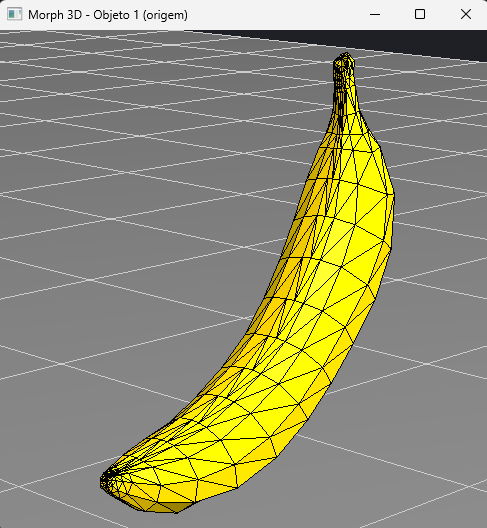
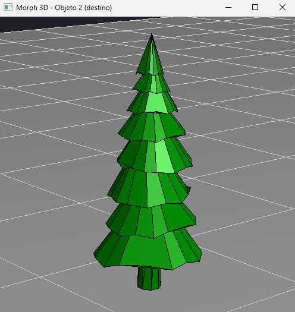
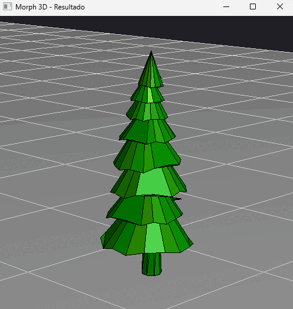

# Morph 3D — mesh-to-mesh transformation by vertex interpolation

[](https://github.com/pedrorivanunes/3d-mesh-morphing/actions/workflows/ci.yml)
[](https://www.python.org/)
[](LICENSE)

A **Python + OpenGL** application that transforms ("morphs") one 3D object into
another, animating the transition directly over the vertices of the meshes. The
program opens three windows side by side: the source object, the target object
and the window where the transformation happens in real time.

---

## About

The goal is to implement, from scratch and without any off-the-shelf morphing
library, the complete pipeline of a transformation between two objects:

- reading and triangulating meshes in the `.obj` format;
- normalizing the objects into a common space;
- matching the faces of the two objects;
- linearly interpolating the vertices over time, producing the animation.

All of the math (centroids, normals, interpolation) is done by hand; OpenGL is
used only for rasterization and lighting.

## Demo

Morph between two light objects (banana and tree): the source object, the target
object and the transformation of one into the other.

<table>
  <tr>
    <td align="center"><b>Source</b><br></td>
    <td align="center"><b>Target</b><br></td>
    <td align="center"><b>Morph</b><br></td>
  </tr>
</table>

### Morph between dense meshes

The same pipeline applied to models with many more polygons (a castle and a human
bust), showing that it works beyond the simple objects:

<table>
  <tr>
    <td align="center"><b>Source</b><br></td>
    <td align="center"><b>Target</b><br></td>
    <td align="center"><b>Morph</b><br></td>
  </tr>
</table>

## How it works

The morphing is split into four steps:

**1. Loading and triangulation.**
The `.obj` reader (`Mesh.load`) reads the vertices (`v`) and the faces (`f`),
ignoring texture and normal indices. Faces with more than three vertices (quads
and n-gons) are converted into triangles by *fan triangulation*, guaranteeing that
every face has exactly three vertices — a necessary condition for the
interpolation to work consistently.

**2. Normalization.**
Each object is centered at the origin and scaled to fit inside a unit cube
(`Mesh.normalize`), based on its *bounding box*. This puts objects of
different sizes and origins into the same frame of reference, which is what makes
it possible to interpolate one into the other coherently. Normalization runs
**exactly once**, at load time.

**3. Face matching.**
Since the two objects have different topologies, we need to decide which face of
one becomes which face of the other. `Mesh.match_faces` computes the
*centroid* of every face and pairs each source face with the target face whose
centroid is closest (nearest neighbour, greedily and without reusing faces while
free ones remain). When one object has more faces than the other, the leftover
faces are handled by reuse, so that no face is left without a partner.

**4. Interpolation.**
Given a parameter `t` that goes from 0 to 1, every vertex of the frame is a
linear interpolation between the source vertex and the target vertex:

```
v(t) = (1 - t) · v_source + t · v_target
```

At `t = 0` the result is exactly the source object; at `t = 1`, exactly the target
one. The animation (`Mesh.interpolate`) simply walks `t` from 0 to 1 across the
frames. *Flat* shading is applied by recomputing the normal of each interpolated
triangle on every frame.

## Face correspondence modes

When the two objects have very different face counts, some faces are left without
a natural partner (the difference between the counts). The program offers three
strategies for those leftover faces, switchable in real time with the `M` key. The
example below is the animal → banana morph, where the banana (612 faces) has about
eleven times fewer triangles than the animal (6838 faces):

<table>
  <tr>
    <td align="center"><b>neighbor</b><br></td>
    <td align="center"><b>collapse</b><br></td>
    <td align="center"><b>random</b><br></td>
  </tr>
</table>

- **neighbor** (default): every leftover face goes to the closest face of the other
  object. The collapses stay local and spread across the surface — the transition
  looks like the mesh densifying locally.
- **collapse**: all the leftover faces go to a single face. It produces the classic
  artifact where the object "emerges from a point" or "shrinks until it vanishes".
  Kept on purpose, to expose the limitation.
- **random**: the leftover faces go to random faces. It gets chaotic and shows, by
  contrast, why spatial correspondence matters.

None of the modes solves the underlying problem — all of them still collapse
triangles down to zero area; they only spread the effect around differently. The
discussion of how to actually solve it is in
[Known limitations](#known-limitations-and-next-steps).

## Running it

Requirements: **Python 3.10+** and a working GLUT/FreeGLUT installation.

```bash
# 1. (optional) virtual environment
python -m venv .venv
source .venv/bin/activate        # Windows: .venv\Scripts\activate

# 2. dependencies
pip install -r requirements.txt

# 3. run
python main.py
```

`PyOpenGL` is only a binding: it does not ship GLUT itself, so the library has to
come from the system.

- **Linux:** install FreeGLUT through the package manager, for example
  `sudo apt install freeglut3-dev libglu1-mesa`.
- **Windows:** the wheel on PyPI contains no DLLs, so `pip install` alone leaves
  `glutInit` undefined. Either drop a 64-bit `freeglut.dll` somewhere on `PATH`,
  or install a PyOpenGL build that bundles it.
- **macOS:** uses the GLUT that ships with the system, so `pip` is enough.

To morph other objects, change the `MODEL_1` and `MODEL_2` constants at the top of
`main.py` (the available names are in the `MODELS` dictionary).

## Controls

Valid in any window:

| Key | Action |
|:---:|:---|
| `W` / `S` | rotate the object around the X axis |
| `A` / `D` | rotate the object around the Y axis |
| `I` / `K` | move the camera up / down |
| `J` / `L` | move the camera left / right |
| `O` / `P` | zoom in / out (field of view) |

Only in the **Result** window:

| Key | Action |
|:---:|:---|
| `1` | pick object 1 as the source (target = object 2) |
| `2` | pick object 2 as the source (target = object 1) |
| `SPACE` | start the morph animation |
| `M` | cycle the leftover-face mode (see above) |

## Project layout

```
3d-mesh-morphing/
├── main.py          # windows, camera, keyboard input and animation loop
├── mesh.py          # geometry: loading, normalization, matching, interpolation
├── renderer.py      # the only module that touches OpenGL
├── point.py         # 3D point/vector and helper operations
├── models/          # example .obj meshes
├── docs/            # images/GIFs used in this README
├── tests/           # geometry tests + one off-screen rendering test
├── Dockerfile       # reproducible environment for the rendering tests
├── pyproject.toml   # pytest, coverage and ruff configuration
├── requirements.txt
└── requirements-dev.txt
```

## Tests

```bash
pip install -r requirements-dev.txt
pytest
```

The suite splits along the same line the code does. `mesh.py` holds the geometry —
parsing `.obj` files, normalizing, matching faces, interpolating — and imports no
OpenGL at all, so those tests run on a machine with no graphics stack installed:
no library, no display, no GPU, no context. `renderer.py` is the only module that
touches the graphics API.

The exception is `tests/test_render.py`, which opens a real GL context, runs the
same `emit_morph` the application calls every frame, and reads the framebuffer
back to confirm that pixels actually changed. It needs a display, so it is marked
`gl` and skips itself when there is none:

```bash
pytest -m "not gl"      # geometry only, runs anywhere
pytest -m gl            # the rendering test alone
```

That split is worth the trouble twice over. It is what lets the geometry tests
run anywhere, and it is what the coverage shows: `mesh.py` is fully covered by the
geometry tests alone, while every line of `renderer.py` is unreachable without a
GL context, so the rendering test is the only thing that can reach it.

Coverage is measured over `mesh.py`, `renderer.py` and `point.py`, which are at
100%. **`main.py` is not covered at all** and is deliberately excluded from the
figure: it is GLUT callbacks and module-level state, verified by running the
application rather than by tests. Counting it would put the number at 44%. The
exclusion is a scoping decision, not a way to make the number look better, so it
is stated here rather than buried in the config.

On Linux the display comes from **Xvfb**, an X server that draws into memory
instead of a monitor, with Mesa's `llvmpipe` software rasterizer standing in for
a GPU. The `Dockerfile` packages exactly that, so the rendering tests give the
same result on a machine with no graphics card:

```bash
docker build -t morph-3d-tests .
docker run --rm morph-3d-tests
```

CI runs the geometry tests on Python 3.10–3.13 on Linux plus one Windows job,
lints with `ruff`, and runs the full suite twice on Linux: once under `xvfb-run`
directly, and once inside the container.

## Known limitations and next steps

This is a didactic implementation and some choices favored clarity over
performance or geometric correctness. The main limitations:

- **Face matching is O(n₁ · n₂).** The nearest-neighbour pairing compares every
  face of one object against every face of the other. It is instantaneous for the
  light models (`easy*`), but gets slow on the heavy ones (`hard*`), where
  precomputing the centroids helps but does not change the complexity class. A
  natural next step would be indexing the centroids in a *k-d tree* or a spatial
  *grid*, bringing the search down to something close to O(n log n).

- **Objects with very different face counts.** The leftover faces have no natural
  partner, which makes triangles collapse to zero area during the transition. The
  program exposes that effect through three selectable modes, compared in the
  [Face correspondence modes](#face-correspondence-modes) section. None of them
  fixes the underlying problem: a real solution would require giving both meshes a
  common topology (e.g. parameterizing both over a sphere and resampling them on a
  shared grid) or solving the correspondence via optimal transport. Left for a
  future rewrite.

- **The vertex correspondence is not geometric.** Inside each pair of faces, the
  vertices are matched by index order, not by position. That makes the transition
  work and look pleasant, but the triangles may "twist" during the interpolation
  instead of following the shortest path.

- **Rotation by two independent angles (X and Y).** It is enough to inspect the
  objects, but it is not a full *orbital* camera (there is no free accumulation of
  orientation over three axes). An *arcball* / quaternions would be the next step.

- **Future rewrite.** The intention is to eventually reimplement the project in an
  improved form — probably with modern OpenGL (shaders/VBOs instead of *immediate
  mode*) and a more robust mesh correspondence strategy.

## Academic context

Coursework for a Computer Graphics course, whose assignment was to load two 3D
objects and transform one into the other by directly manipulating their vertices.
The code was revised afterwards: bug fixes, reorganization into modules and
documentation.

## License

[MIT](LICENSE)
