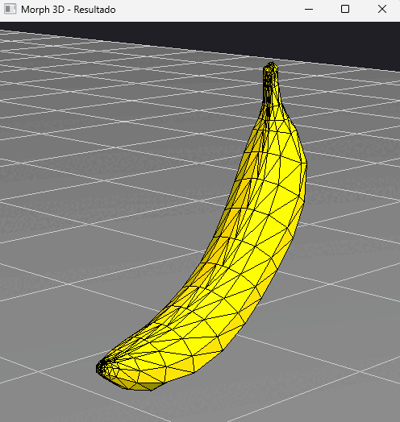
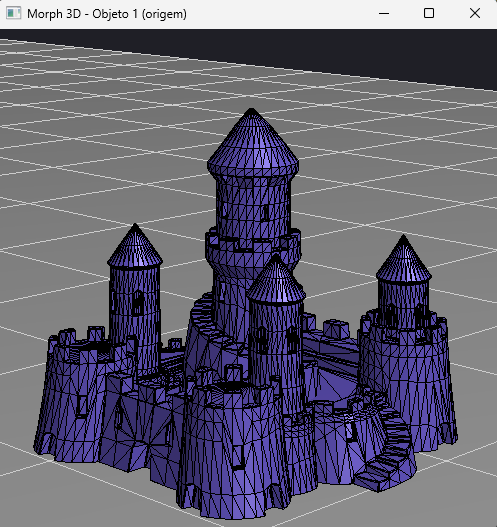
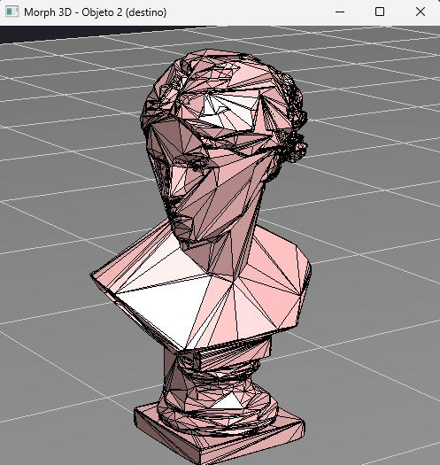
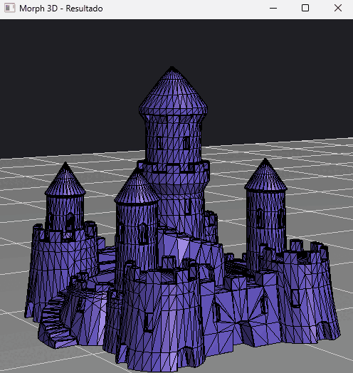
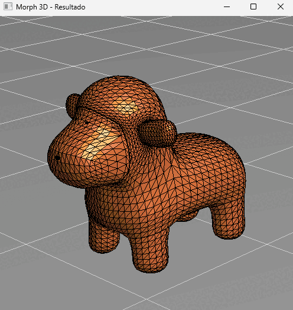

# Morph 3D — transformação entre malhas por interpolação de vértices

Aplicação em **Python + OpenGL** que transforma ("morfa") um objeto 3D em outro,
animando a transição diretamente sobre os vértices das malhas. O programa abre
três janelas lado a lado: o objeto de origem, o objeto de destino e a janela onde
a transformação acontece em tempo real.

---

## Sobre

O objetivo é implementar, do zero e sem bibliotecas de morphing prontas, o
pipeline completo de uma transformação entre dois objetos:

- leitura e triangulação de malhas no formato `.obj`;
- normalização dos objetos para um espaço comum;
- associação entre as faces dos dois objetos;
- interpolação linear dos vértices ao longo do tempo, gerando a animação.

Toda a matemática (centróides, normais, interpolação) é feita manualmente; o
OpenGL é usado apenas para rasterização e iluminação.

## Demonstração

Morph entre dois objetos leves (banana e árvore): o objeto de origem, o de destino
e a transformação de um no outro.

<table>
  <tr>
    <td align="center"><b>Origem</b><br></td>
    <td align="center"><b>Destino</b><br></td>
    <td align="center"><b>Morph</b><br></td>
  </tr>
</table>

### Morph entre malhas densas

O mesmo pipeline aplicado a modelos com muito mais polígonos (castelo e busto
humano), mostrando que funciona além dos objetos simples:

<table>
  <tr>
    <td align="center"><b>Origem</b><br></td>
    <td align="center"><b>Destino</b><br></td>
    <td align="center"><b>Morph</b><br></td>
  </tr>
</table>

## Como funciona

O morphing é dividido em quatro etapas:

**1. Carregamento e triangulação.**
O leitor de `.obj` (`Objeto3D.carrega`) lê os vértices (`v`) e as faces (`f`),
ignorando índices de textura e normal. Faces com mais de três vértices (quads e
n-gons) são convertidas em triângulos por *triangulação em leque*, garantindo que
todas as faces tenham exatamente três vértices — condição necessária para a
interpolação funcionar de forma consistente.

**2. Normalização.**
Cada objeto é centralizado na origem e escalado para caber em um cubo unitário
(`Objeto3D.normaliza`), a partir da sua *bounding box*. Isso coloca objetos de
tamanhos e origens diferentes em um mesmo referencial, o que é o que permite
interpolar um no outro de maneira coerente. A normalização é executada **uma
única vez**, no carregamento.

**3. Associação de faces.**
Como os dois objetos têm topologias diferentes, é preciso decidir qual face de um
vira qual face do outro. `Objeto3D.associa_faces` calcula o *centróide* de cada
face e casa cada face da origem com a face de destino de centróide mais próximo
(vizinho mais próximo, de forma gulosa e sem reutilizar faces enquanto houver
opções livres). Quando um objeto tem mais faces que o outro, as faces excedentes
são tratadas por reaproveitamento, de modo que nenhuma face fique sem par.

**4. Interpolação.**
Dado um parâmetro `t` que varia de 0 a 1, cada vértice do quadro é uma
interpolação linear entre o vértice de origem e o de destino:

```
v(t) = (1 - t) · v_origem + t · v_destino
```

Em `t = 0` o resultado é exatamente o objeto de origem; em `t = 1`, exatamente o
de destino. A animação (`Objeto3D.emite_morph`) simplesmente percorre `t` de 0 a
1 ao longo dos quadros. Iluminação *flat* é aplicada recalculando a normal de
cada triângulo interpolado a cada quadro.

## Modos de correspondência de faces

Quando os dois objetos têm números de faces muito diferentes, sobram faces sem par
natural (a diferença entre as contagens). O programa oferece três estratégias para
lidar com essas faces excedentes, alternáveis em tempo real com a tecla `M`. O
exemplo abaixo é o morph animal → banana, em que a banana (612 faces) tem cerca de
onze vezes menos triângulos que o animal (6838 faces):

<table>
  <tr>
    <td align="center"><b>vizinho</b><br></td>
    <td align="center"><b>colapso</b><br></td>
    <td align="center"><b>aleatório</b><br></td>
  </tr>
</table>

- **vizinho** (padrão): cada face excedente vai para a face mais próxima do outro
  objeto. Os colapsos ficam locais e espalhados pela superfície — a transição
  parece a malha adensando localmente.
- **colapso**: todas as faces excedentes vão para uma única face. Produz o artefato
  clássico em que o objeto "surge de um ponto" ou "encolhe até sumir". Mantido de
  propósito para expor a limitação.
- **aleatório**: as faces excedentes vão para faces aleatórias. Fica caótico e
  mostra, por contraste, por que a correspondência espacial importa.

Nenhum dos modos resolve o problema de fundo — todos ainda colapsam triângulos a
área zero; eles apenas distribuem o efeito de formas diferentes. A discussão de
como resolvê-lo de verdade está em [Limitações conhecidas](#limitações-conhecidas-e-próximos-passos).

## Como executar

Requisitos: **Python 3.10+** e uma instalação funcional de GLUT/FreeGLUT.

```bash
# 1. (opcional) ambiente virtual
python -m venv .venv
source .venv/bin/activate        # Windows: .venv\Scripts\activate

# 2. dependências
pip install -r requirements.txt

# 3. rodar
python main.py
```

Observações por sistema:

- **Windows:** o pacote `PyOpenGL` já inclui o FreeGLUT; normalmente não é
  preciso instalar nada além do `requirements.txt`.
- **Linux:** pode ser necessário instalar o FreeGLUT pelo gerenciador de pacotes,
  por exemplo `sudo apt install freeglut3-dev`.
- **macOS:** usa o GLUT do sistema; a instalação via `pip` costuma bastar.

Para morfar outros objetos, altere as constantes `MODELO_1` e `MODELO_2` no topo
do `main.py` (os nomes disponíveis estão no dicionário `MODELOS`).

## Controles

Válidos em qualquer janela:

| Tecla | Ação |
|:---:|:---|
| `W` / `S` | rotaciona o objeto em torno do eixo X |
| `A` / `D` | rotaciona o objeto em torno do eixo Y |
| `I` / `K` | move a câmera para cima / para baixo |
| `J` / `L` | move a câmera para a esquerda / direita |
| `O` / `P` | aproxima / afasta (campo de visão) |

Somente na janela **Resultado**:

| Tecla | Ação |
|:---:|:---|
| `1` | escolhe o objeto 1 como origem (destino = objeto 2) |
| `2` | escolhe o objeto 2 como origem (destino = objeto 1) |
| `ESPAÇO` | inicia a animação do morph |
| `M` | alterna o modo de tratamento das faces excedentes (ver abaixo) |

## Estrutura do projeto

```
morph-3d/
├── main.py          # janelas, câmera, entrada de teclado e laço de animação
├── objeto3d.py      # carregamento, normalização, associação e morph de malhas
├── ponto.py         # ponto/vetor 3D e operações auxiliares
├── models/          # malhas .obj de exemplo
├── docs/            # imagens/GIF usados neste README
├── requirements.txt
└── LICENSE
```

## Limitações conhecidas e próximos passos

Esta é uma implementação didática e algumas escolhas foram feitas priorizando
clareza sobre desempenho ou correção geométrica. As principais limitações:

- **Associação de faces é O(n₁ · n₂).** O casamento por vizinho mais próximo
  compara todas as faces de um objeto com todas as do outro. É instantâneo para
  os modelos leves (`easy*`), mas fica lento nos modelos pesados (`hard*`), onde
  o pré-cálculo de centróides ajuda mas não muda a ordem de complexidade. Um
  próximo passo natural seria indexar os centróides em uma *k-d tree* ou *grid*
  espacial, reduzindo a busca para algo próximo de O(n log n).

- **Objetos com números de faces muito diferentes.** As faces excedentes não têm
  par natural, o que faz triângulos colapsarem a área zero durante a transição. O
  programa expõe esse efeito através de três modos selecionáveis, comparados na
  seção [Modos de correspondência de faces](#modos-de-correspondência-de-faces).
  Nenhum deles corrige o problema de fundo: a solução real exigiria dar às duas
  malhas uma topologia comum (ex.: parametrizar ambas sobre uma esfera e reamostrar
  numa grade compartilhada) ou resolver a correspondência via transporte ótimo.
  Fica para a reescrita futura.

- **A correspondência entre vértices não é geométrica.** Dentro de cada par de
  faces, os vértices são casados por ordem de índice, não por posição. Isso faz a
  transição funcionar e ficar visualmente agradável, mas os triângulos podem
  "torcer" durante a interpolação em vez de seguir o caminho mais curto.

- **Rotação por dois ângulos independentes (X e Y).** É suficiente para inspecionar
  os objetos, mas não é uma câmera *orbital* completa (não há acúmulo livre de
  orientação em três eixos). Um *arcball* / quatérnions seriam o passo seguinte.

- **Reescrita futura.** A intenção é, mais adiante, reimplementar o projeto de
  forma aprimorada — provavelmente com OpenGL moderno (shaders/VBOs em vez do
  *immediate mode*) e uma estratégia de correspondência de malhas mais robusta.

## Contexto acadêmico

Trabalho da disciplina de Computação Gráfica, cujo enunciado consistia em carregar
dois objetos 3D e transformar um no outro pela manipulação direta de seus
vértices. O código foi posteriormente revisado: correção de bugs,
reorganização em módulos e documentação.
